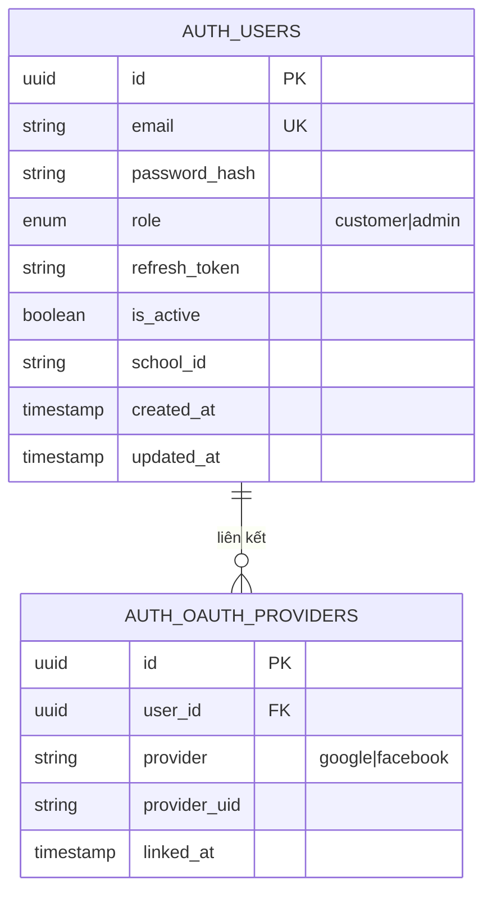
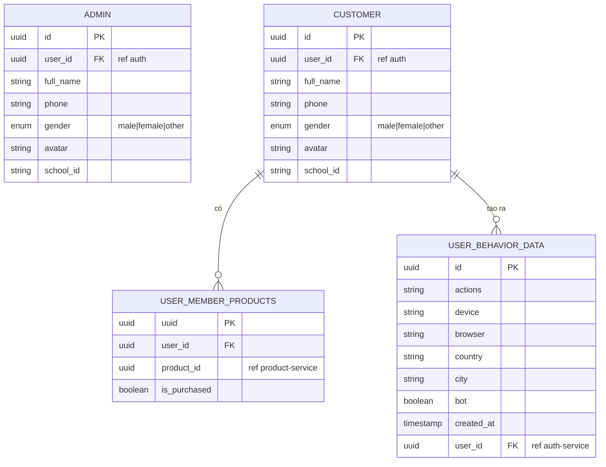
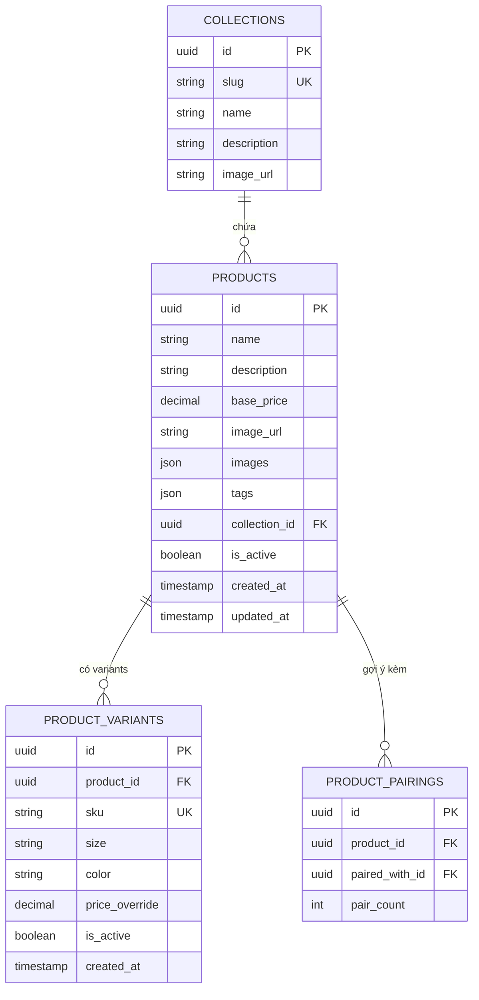
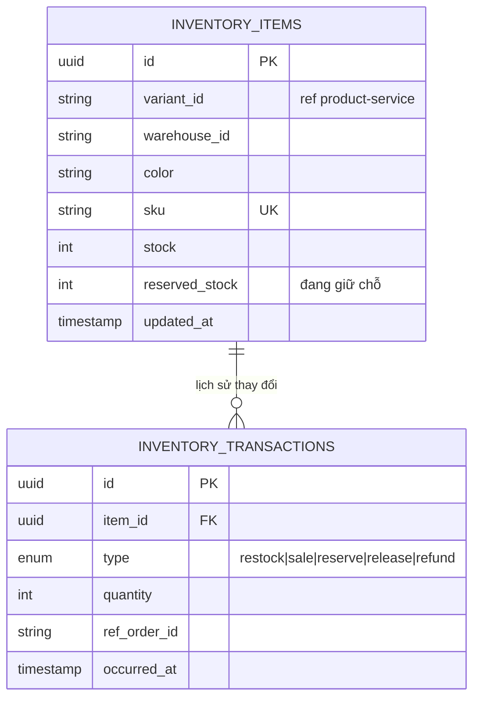
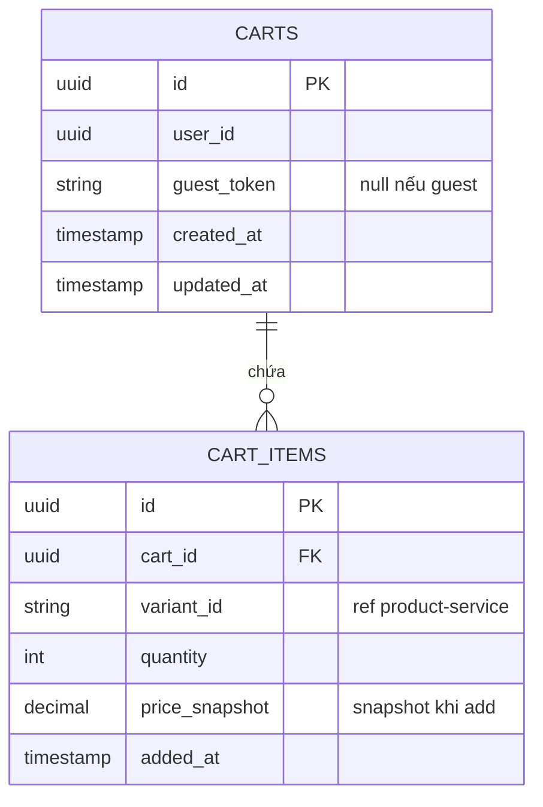
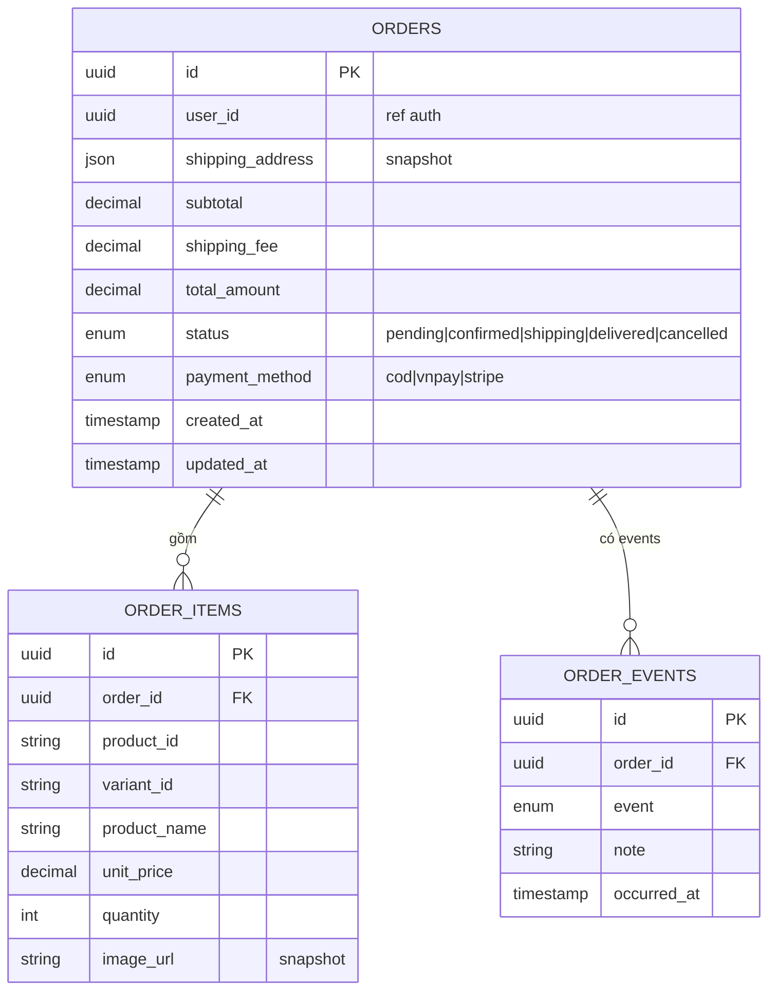
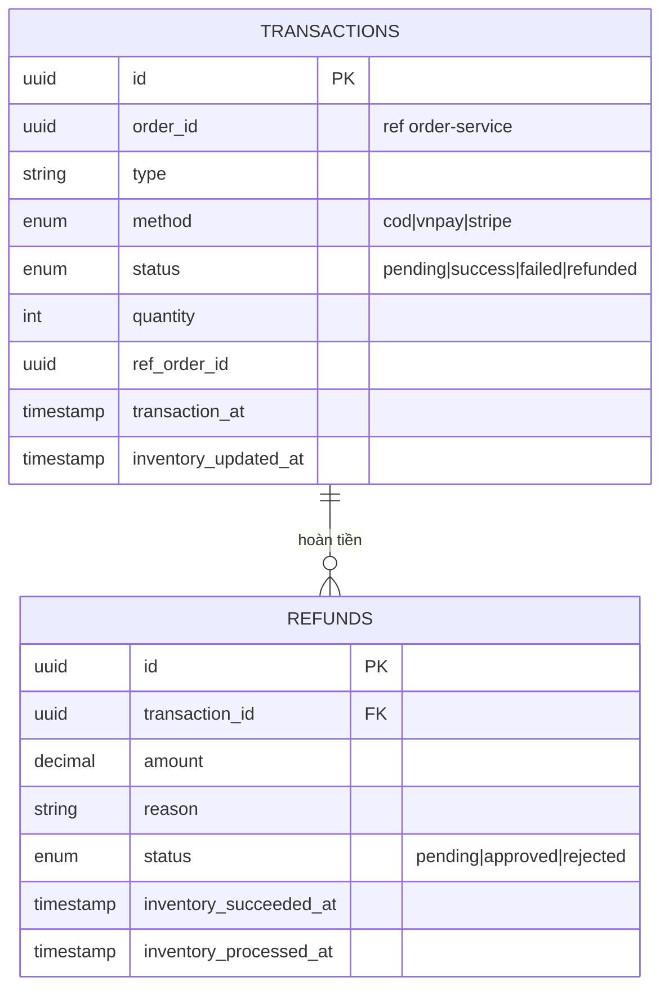
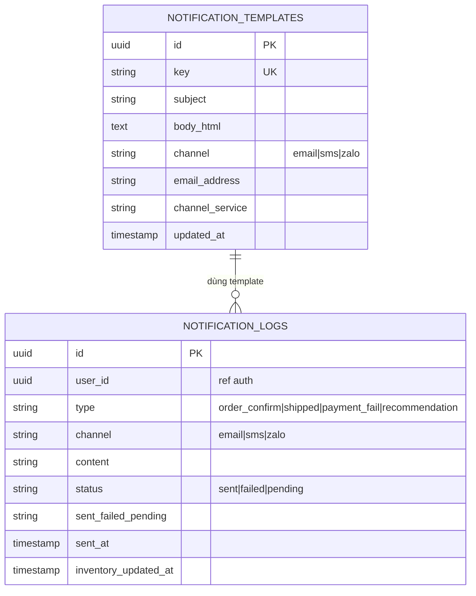

# Kiến Trúc Microservice – Website Bán Quần Áo

> **Stack thực tế:** NestJS 11 · TypeORM 0.3 · PostgreSQL (Neon.tech Cloud, SSL) · TypeScript 5
>
> **Phạm vi:** 9 service đã được khởi tạo trong thư mục `microservices/`. Kế hoạch mở rộng dần – chỉ ghi nhận những gì đã tồn tại trong codebase.

---

## 0. Tổng Quan Hệ Thống

```
                        ┌─────────────────────┐
                        │     Frontend          │
                        │  Next.js (port ?)     │
                        └────────┬────────────-─┘
                                 │ HTTP
                        ┌────────▼─────────────┐
                        │     api-gateway       │
                        │   NestJS (port TBD)   │
                        └──┬──┬──┬──┬──┬──┬──┬─┘
                           │  │  │  │  │  │  │  │
         ┌─────────────────┘  │  │  │  │  │  │  └──────────────────┐
         ▼                    ▼  │  │  │  │  ▼                     ▼
  product-service      user-service  │  │  │  │   payment-service  notification-service
    :3001               :3002    │  │  │  │     :3003              :3005
                                 ▼  │  │  ▼
                          order-service  │  inventory-service
                            :3004    │       :3006
                                     ▼
                              cart-service
                                :3007
                           authentication-service
                                :3008
```

---

## 1. Danh Sách Service & Port

| # | Service                          | Port | DB (Neon PostgreSQL)     | Trạng thái  |
| - | -------------------------------- | ---- | ------------------------ | ------------- |
| 0 | **api-gateway**            | TBD  | – (no DB riêng)        | 🔨 Khởi tạo |
| 1 | **product-service**        | 3001 | `ep-curly-dawn-...`    | 🔨 Khởi tạo |
| 2 | **user-service**           | 3002 | `ep-winter-night-...`  | 🔨 Khởi tạo |
| 3 | **payment-service**        | 3003 | `ep-fancy-glade-...`   | 🔨 Khởi tạo |
| 4 | **order-service**          | 3004 | `ep-cold-dream-...`    | 🔨 Khởi tạo |
| 5 | **notification-service**   | 3005 | `ep-shy-cell-...`      | 🔨 Khởi tạo |
| 6 | **inventory-service**      | 3006 | `ep-spring-scene-...`  | 🔨 Khởi tạo |
| 7 | **cart-service**           | 3007 | `ep-old-base-...`      | 🔨 Khởi tạo |
| 8 | **authentication-service** | 3008 | `ep-noisy-glitter-...` | 🔨 Khởi tạo |

> Mỗi service có **database Neon PostgreSQL riêng** (SSL bắt buộc, `rejectUnauthorized: false`).
> api-gateway **không có DB riêng** – chỉ proxy/route request.

---

## 2. Trách Nhiệm Chính Từng Service

| Service                          | Trách nhiệm                                                                                                                             |
| -------------------------------- | ----------------------------------------------------------------------------------------------------------------------------------------- |
| **api-gateway**            | Điểm vào duy nhất của hệ thống. Xác thực JWT, rate limiting, proxy request đến đúng service, logging tập trung              |
| **authentication-service** | Đăng ký, đăng nhập, đăng xuất, quản lý JWT/session, refresh token, OAuth (nếu cần)                                           |
| **user-service**           | Quản lý hồ sơ cá nhân, địa chỉ giao hàng, lịch sử xem/mua, sở thích thời trang, dữ liệu hành vi (phục vụ n8n gợi ý) |
| **product-service**        | CRUD sản phẩm, tìm kiếm, lọc (theo category/collection), sắp xếp, hình ảnh, gợi ý mua kèm                                     |
| **inventory-service**      | Quản lý tồn kho theo variant (size/màu), cập nhật số lượng khi đặt hàng, cảnh báo hết hàng                                |
| **cart-service**           | Thêm/xoá/cập nhật sản phẩm trong giỏ, tính tổng tạm thời, liên kết guest cart → user cart sau login                         |
| **order-service**          | Tạo đơn hàng từ giỏ hàng, trạng thái đơn (pending → confirmed → shipped → delivered), lịch sử đơn                       |
| **payment-service**        | Xử lý thanh toán (VNPay/Stripe/COD), xác nhận giao dịch, hoàn tiền, lưu lịch sử giao dịch                                     |
| **notification-service**   | Gửi email/SMS/Zalo xác nhận đơn hàng, thông báo trạng thái, nhận event async từ message queue                                 |

---

## 3. Luồng Nghiệp Vụ Cơ Bản

```
[Khách hàng]
    │
    ├─ Tất cả request ──────────► api-gateway (xác thực JWT, route)
    │
    ├─ Tìm kiếm/xem sản phẩm ──► product-service
    │                                └─ Kiểm tra tồn kho hiển thị → inventory-service
    │
    ├─ Đăng nhập/đăng ký ──────► authentication-service ──► trả JWT
    │                                └─ Tạo profile ──────────► user-service
    │
    ├─ Hỏi chatbot/tư vấn ─────► n8n Automation
    │                                ├─ Đọc hồ sơ → user-service
    │                                └─ Gợi ý sản phẩm → product-service
    │
    ├─ Thêm vào giỏ ────────────► cart-service
    │                                └─ Kiểm tra còn hàng → inventory-service
    │
    ├─ Đặt hàng ─────────────────► order-service
    │                                ├─ Lấy thông tin giỏ   → cart-service
    │                                ├─ Lấy địa chỉ giao    → user-service
    │                                ├─ Trừ tồn kho         → inventory-service
    │                                └─ Yêu cầu thanh toán  → payment-service
    │
    ├─ Thanh toán ───────────────► payment-service
    │                                └─ Xác nhận → order-service (status: confirmed)
    │                                              ├─ Phát event → notification-service
    │                                              └─ Ghi lịch sử → user-service
    │
    └─ Nhận thông báo ──────────► notification-service (email/SMS/Zalo)
```

---

## 4. Tích Hợp n8n – Tự Động Hoá

### Các Workflow n8n Gợi Ý

| Workflow                         | Trigger                                               | Hành động                                                                                                                           |
| -------------------------------- | ----------------------------------------------------- | -------------------------------------------------------------------------------------------------------------------------------------- |
| **Auto-reply chatbot**     | Khách hàng gửi tin nhắn (Facebook/Zalo/Live chat) | n8n gọi `user-service` lấy profile → gọi `product-service` lấy gợi ý → trả lời tự động qua API nhắn tin              |
| **Gợi ý mua kèm**       | Khách xem chi tiết sản phẩm (áo)                 | n8n truy vấn `product-service` `GET /products/:id/frequently-bought-with` → hiển thị sản phẩm gợi ý (quần phù hợp)      |
| **Gợi ý cá nhân hoá** | Khách login, vào trang chủ                         | n8n gọi `user-service` lấy `purchase_history` + `viewed_categories` → gọi `product-service` để lọc sản phẩm phù hợp |
| **Remarketing tự động** | Khách bỏ giỏ hàng > 1 giờ                        | n8n nhận event từ `cart-service` → gọi `notification-service` gửi email/SMS nhắc nhở                                        |
| **Chăm sóc sau mua**     | Đơn hàng delivered                                 | n8n nhận event từ `order-service` → gửi tin nhắn cảm ơn + gợi ý sản phẩm tương tự                                      |

### Kiến trúc n8n tích hợp

```
[Các Service] ──► Message Queue (Redis/RabbitMQ) ──► n8n Webhook Triggers
                                                         │
                                                    n8n Workflows
                                                         │
                                    ┌────────────────────┼────────────────────┐
                                    ▼                    ▼                    ▼
                             user-service         product-service      notification-service
                             (đọc profile)        (lấy gợi ý)         (gửi tin nhắn)
```

---

## 5. Dữ Liệu Mỗi Service Quản Lý Riêng

| Service                          | Dữ liệu sở hữu                                                                                                                 |
| -------------------------------- | ---------------------------------------------------------------------------------------------------------------------------------- |
| **api-gateway**            | Không có DB – chỉ config route, rate-limit, auth middleware                                                                    |
| **authentication-service** | `auth_users` (id, email, passwordHash, role, refreshToken, createdAt)                                                            |
| **user-service**           | `user_profiles` (id, userId, fullName, phone, gender, birthday, style_preferences), `user_addresses`, `user_viewed_products` |
| **product-service**        | `products` (id, name, price, images, category, description, tags), `collections`, `product_pairings`                         |
| **inventory-service**      | `inventory` (id, productId, variantId, size, color, sku, stock, reserved_stock, updatedAt)                                       |
| **cart-service**           | `carts` (id, userId/guestId, expiresAt), `cart_items` (cartId, productId, variantId, quantity, price_snapshot)                 |
| **order-service**          | `orders` (id, userId, status, totalAmount, shippingAddress), `order_items` (snapshot), `order_events`                        |
| **payment-service**        | `transactions` (id, orderId, amount, method, status, gatewayRef, gatewayPayload), `refunds`                                    |
| **notification-service**   | `notification_logs` (id, userId, type, channel, status, sentAt), `notification_templates`                                      |

> **Nguyên tắc:** Mỗi service có DB riêng trên Neon. Không service nào được query thẳng DB của service khác – chỉ giao tiếp qua API (HTTP) hoặc event (Message Queue).

---

## 6. API Chính Từng Service

### api-gateway

```
[Proxy tất cả request – thêm header X-User-Id sau khi verify JWT]
GET    /health                 – Health check tổng thể
*      /api/products/*         → product-service:3001
*      /api/users/*            → user-service:3002
*      /api/payments/*         → payment-service:3003
*      /api/orders/*           → order-service:3004
*      /api/notifications/*    → notification-service:3005
*      /api/inventory/*        → inventory-service:3006
*      /api/cart/*             → cart-service:3007
*      /api/auth/*             → authentication-service:3008
```

### authentication-service (:3008)

```
POST   /auth/register          – Đăng ký tài khoản
POST   /auth/login             – Đăng nhập, trả JWT + refreshToken
POST   /auth/logout            – Đăng xuất (invalidate refresh token)
POST   /auth/refresh           – Đổi refresh token lấy JWT mới
GET    /auth/me                – Lấy thông tin user hiện tại (cần JWT)
```

### user-service (:3002)

```
GET    /users/:id/profile      – Lấy hồ sơ cá nhân
PUT    /users/:id/profile      – Cập nhật hồ sơ (tên, SĐT, giới tính, sở thích thời trang)
GET    /users/:id/addresses    – Danh sách địa chỉ giao hàng
POST   /users/:id/addresses    – Thêm địa chỉ
PUT    /users/:id/addresses/:addrId  – Sửa địa chỉ
DELETE /users/:id/addresses/:addrId  – Xoá địa chỉ

[Internal – phục vụ n8n]
GET    /users/:id/behavior           – Hành vi: viewed_products, preferred_categories
POST   /users/:id/viewed             – Ghi lại sản phẩm vừa xem
GET    /users/:id/recommendations-context  – Tổng hợp dữ liệu cá nhân cho n8n
```

### product-service (:3001)

```
GET    /products               – Danh sách sản phẩm (query: q, category, sort, page, limit)
GET    /products/:id           – Chi tiết sản phẩm
GET    /products/collections   – Danh sách collections/categories
GET    /products/:id/frequently-bought-with  – Gợi ý mua kèm

[Admin]
POST   /products               – Tạo sản phẩm
PUT    /products/:id           – Cập nhật sản phẩm
DELETE /products/:id           – Xoá sản phẩm
POST   /products/pairings      – Thiết lập cặp sản phẩm thường mua kèm
```

### inventory-service (:3006)

```
GET    /inventory/:productId   – Tồn kho của sản phẩm (tất cả variant)
GET    /inventory/:productId/variants/:variantId  – Tồn kho 1 variant cụ thể
PATCH  /inventory/:productId/variants/:variantId  – Cập nhật stock (admin)
POST   /inventory/reserve      – Giữ chỗ tạm thời khi checkout { variantId, quantity }
POST   /inventory/release      – Huỷ giữ chỗ (khi cancel/timeout)
POST   /inventory/confirm      – Xác nhận trừ hàng sau thanh toán thành công
```

### cart-service (:3007)

```
GET    /cart                   – Lấy giỏ hàng hiện tại (JWT hoặc guestId)
POST   /cart/items             – Thêm sản phẩm { productId, variantId, quantity }
PUT    /cart/items/:variantId  – Cập nhật số lượng
DELETE /cart/items/:variantId  – Xoá sản phẩm khỏi giỏ
DELETE /cart                   – Xoá toàn bộ giỏ hàng
POST   /cart/merge             – Merge guest cart vào user cart sau login
```

### order-service (:3004)

```
POST   /orders                 – Tạo đơn hàng từ giỏ { shippingAddressId, paymentMethod }
GET    /orders                 – Lịch sử đơn hàng của user
GET    /orders/:id             – Chi tiết đơn hàng
PATCH  /orders/:id/cancel      – Huỷ đơn (nếu còn pending)

[Admin/Webhook]
PATCH  /orders/:id/status      – Cập nhật trạng thái đơn
```

### payment-service (:3003)

```
POST   /payments/initiate      – Khởi tạo thanh toán { orderId, method }
POST   /payments/callback      – Webhook từ cổng thanh toán (VNPay/Stripe)
GET    /payments/:orderId      – Trạng thái thanh toán của đơn hàng
POST   /payments/:id/refund    – Yêu cầu hoàn tiền
```

### notification-service (:3005)

```
[Internal only – nhận event từ các service khác]
POST   /notify/order-confirmed – Gửi email xác nhận đơn
POST   /notify/order-shipped   – Gửi thông báo vận chuyển
POST   /notify/payment-failed  – Gửi thông báo thanh toán thất bại
POST   /notify/recommendation  – Gửi tin nhắn gợi ý cá nhân (từ n8n)

GET    /notify/logs/:userId    – [Admin] Lịch sử thông báo
```

---

## 7. Sơ Đồ ERD Từng Service

### authentication-service



---

### user-service



---

### product-service



---

### inventory-service



---

### cart-service



---

### order-service



---

### payment-service



---

### notification-service



---

## 8. Thứ Tự Triển Khai (Theo Mức Độ Ưu Tiên)

| Ưu tiên      | Service                          | Lý do                                                                                       |
| -------------- | -------------------------------- | -------------------------------------------------------------------------------------------- |
| 🥇**1**  | **product-service**        | Nền tảng – website đã có trang search/filter, cần backend thật thay mock data        |
| 🥇**2**  | **authentication-service** | Cần thiết trước khi có cart/order – mọi hành động cần user identity               |
| 🥇**3**  | **api-gateway**            | Điểm vào hệ thống – cần có sớm để route đúng và xác thực JWT tập trung      |
| 🥈**4**  | **inventory-service**      | Tách tồn kho ra riêng – product chỉ giữ thông tin mô tả, inventory giữ số lượng |
| 🥈**5**  | **user-service**           | Cần sớm để tích hợp n8n và cá nhân hoá trải nghiệm                               |
| 🥈**6**  | **cart-service**           | Bước tiếp theo tự nhiên sau khi user login và xem sản phẩm                           |
| 🥉**7**  | **order-service**          | Chuyển đổi giỏ hàng thành đơn – core của luồng mua hàng                          |
| 🥉**8**  | **payment-service**        | Tích hợp sau khi order flow hoạt động ổn định                                        |
| 🏅**9**  | **notification-service**   | Không block luồng chính, thêm async sau cùng                                            |
| 🏅**10** | **n8n Automation**         | Kết nối sau khi user-service + product-service sẵn sàng                                  |

### Lộ Trình Gợi Ý

```
Giai đoạn 1 (MVP):      product-service + authentication-service + api-gateway
                          → Trang search thật, login/JWT, routing tập trung

Giai đoạn 2 (Core):     inventory-service + user-service + cart-service + order-service
                          → Hồ sơ, tồn kho, đặt hàng (COD trước)

Giai đoạn 3 (Full):     payment-service + notification-service
                          → Thanh toán online + thông báo tự động

Giai đoạn 4 (Smart):    n8n Automation
                          → Chatbot tư vấn + gợi ý cá nhân hoá
```

---

## Ghi Chú Kỹ Thuật

- **Framework:** NestJS 11 + TypeORM 0.3 + TypeScript 5 cho tất cả service.
- **Database:** Neon PostgreSQL (cloud, SSL bắt buộc), mỗi service dùng 1 DB riêng biệt. `synchronize: true` chỉ dùng khi dev – phải tắt ở production.
- **api-gateway:** Chưa có `.env` – cần cấu hình port và upstream URLs cho 8 service còn lại.
- **Giao tiếp đồng bộ:** REST/HTTP qua api-gateway.
- **Giao tiếp bất đồng bộ:** Message queue (Redis Pub/Sub hoặc RabbitMQ) cho: `order-service` → `inventory-service` (trừ kho), `order-service` → `notification-service`, `payment-service` → `order-service`, `cart-service` → `n8n` (remarketing).
- **Auth Guard:** api-gateway xác thực JWT tập trung, truyền `X-User-Id` header xuống các service con.
- **inventory-service** (mới so với kế hoạch ban đầu): Tách biệt khỏi `product-service` để scale độc lập và tránh blocking khi cập nhật tồn kho real-time.
- **Frontend Next.js:** Thay `mockProducts` bằng call đến `api-gateway/api/products`.
